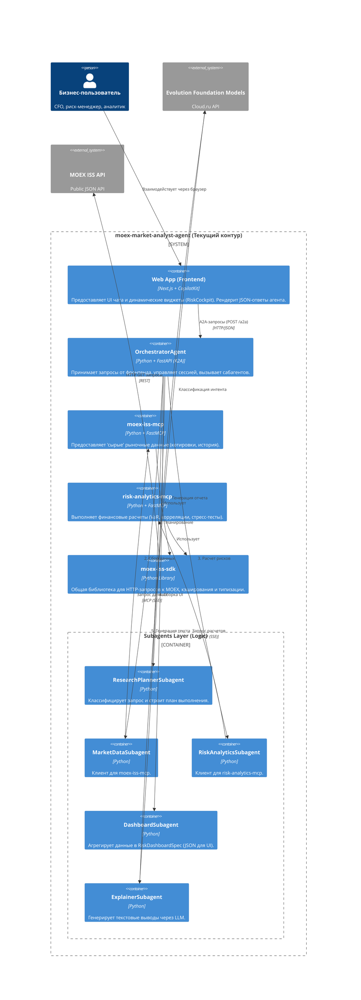

# Архитектура проекта: MOEX Market Analyst Agent (Current State)

## 1. Обзор системы

Проект представляет собой мультиагентную систему для финансовой аналитики российского фондового рынка. Архитектура построена на паттерне **Orchestrator-Workers**, где центральный агент управляет специализированными сабагентами, взаимодействующими с данными через протокол **MCP (Model Context Protocol)**. Пользовательский интерфейс реализован по принципу **Generative UI** (Server-Driven UI).

### Ключевые характеристики текущей реализации:

- **Мультиагентность:** Четкое разделение ответственности (Планирование, Рыночные данные, Риски, UI, Объяснение).
- **MCP-first:** Все данные и расчеты вынесены в отдельные микросервисы (MCP-серверы).
- **Shared SDK:** Общая библиотека доступа к MOEX ISS гарантирует согласованность данных между сервисами.
- **Generative UI:** Агент не просто возвращает текст, а генерирует спецификацию дашборда (`RiskDashboardSpec`), которую рендерит фронтенд.

---

## 2. Компонентная диаграмма (C4 Level 2 - Containers)

Система состоит из 4 основных контейнеров, разворачиваемых через Docker Compose:

1.  **Web Frontend (`apps/web`)**: Next.js приложение с интеграцией CopilotKit.
2.  **Agent Service (`packages/agent-service`)**: Мозг системы. Оркестратор и сабагенты.
3.  **MOEX ISS MCP (`moex_iss_mcp`)**: Шлюз к данным Мосбиржи.
4.  **Risk Analytics MCP (`risk_analytics_mcp`)**: Движок финансовых расчетов.

---

## 3. Детальное описание реализованных компонентов

### 3.1. Frontend (`apps/web`)

- **Технологии:** Next.js 14, TypeScript, Tailwind, Recharts, CopilotKit.
- **Функции:**
  - Чат с агентом через `CopilotSidebar`.
  - Рендеринг динамических дашбордов (`RiskCockpit`) на основе JSON-схемы, полученной от агента.
  - Визуализация: Графики (`AllocationChart`, `EquityChart`), Таблицы (`RiskTable`), Алерты (`AlertBlock`).
- **Статус:** Реализован. Поддерживает стриминг ответов и рендеринг компонентов.

### 3.2. Agent Service (`packages/agent-service`)

Центральный сервис, обрабатывающий запросы.

- **Orchestrator (`OrchestratorAgent`):**
  - Принимает запрос.
  - Классифицирует намерение (`IntentClassifier`): использует Regex-паттерны + LLM fallback.
  - Выбирает статический или динамический пайплайн выполнения (`ScenarioPipeline`).
- **Subagents (Сабагенты):**
  - `ResearchPlanner`: Планирует шаги выполнения (через LLM).
  - `MarketData`: Клиент к `moex-iss-mcp`.
  - `RiskAnalytics`: Клиент к `risk-analytics-mcp`.
  - `Dashboard`: Агрегирует данные и собирает JSON-структуру `RiskDashboardSpec` (без LLM, чистый код).
  - `Explainer`: Генерирует текстовый отчет для пользователя (через LLM) с учетом роли (CFO/Analyst).
- **Инфраструктура:**
  - `McpClient`: Универсальный HTTP-клиент для MCP (с ретраями и маппингом ошибок).
  - `EvolutionLLMClient`: Клиент к Cloud.ru Evolution Models.

### 3.3. MOEX ISS MCP (`moex_iss_mcp`)

Сервер доступа к данным.

- **Tools:**
  - `get_security_snapshot`: Текущие цены.
  - `get_ohlcv_timeseries`: Исторические свечи.
  - `get_index_constituents_metrics`: Состав индексов.
- **Особенности:** Использует `moex_iss_sdk` для HTTP-запросов к бирже, кэширования и нормализации ошибок.

### 3.4. Risk Analytics MCP (`risk_analytics_mcp`)

Сервер финансовой математики.

- **Tools:**
  - `compute_portfolio_risk_basic`: VaR, просадка, волатильность.
  - `compute_correlation_matrix`: Матрица корреляций Пирсона.
  - `suggest_rebalance`: Алгоритмическая ребалансировка портфеля.
  - `build_cfo_liquidity_report`: Отчет по ликвидности и стресс-тесты.
  - `issuer_peers_compare`: Сравнение мультипликаторов (P/E, EV/EBITDA).
- **Особенности:** Содержит доменную логику в папке `calculations/`. Использует `moex_iss_sdk` напрямую для получения данных, необходимых для расчетов.

### 3.5. Shared SDK (`moex_iss_sdk`)

Общая библиотека Python.

- Единый `IssClient` с rate limiting и кэшированием.
- Pydantic-модели для ответов ISS.
- Единая карта ошибок (`ErrorMapper`) для трансляции HTTP-ошибок в MCP-ошибки.

---

## 4. Потоки данных (Data Flow)

### Сценарий: "Оцени риск портфеля SBER 50%, GAZP 50%"

1.  **User -> Web:** Ввод запроса в чат.
2.  **Web -> Agent Service:** POST `/api/copilot` -> прокси на Agent Service.
3.  **Orchestrator:**
    - `IntentClassifier` определяет сценарий `PORTFOLIO_RISK`.
    - `QueryParser` извлекает позиции (SBER: 0.5, GAZP: 0.5).
    - Запускает пайплайн: `MarketData` -> `RiskAnalytics` -> `Dashboard` -> `Explainer`.
4.  **MarketData Subagent:** Вызывает `moex-iss-mcp` (получение свечей).
5.  **RiskAnalytics Subagent:** Вызывает `risk-analytics-mcp` (расчет VaR, Volatility).
6.  **Dashboard Subagent:** Собирает JSON `RiskDashboardSpec` из полученных метрик.
7.  **Explainer Subagent:** Отправляет метрики в LLM и просит написать отчет для роли "Risk Manager".
8.  **Agent Service -> Web:** Возвращает JSON с текстом и объектом `dashboard`.
9.  **Web:** Рендерит текст сообщения и компонент `<RiskCockpit />`.

---

## 5. Gap-анализ (Реализовано vs Запланировано)

На основе анализа папки `docs/` и текущего кода:

| Компонент / Функция       | Статус             | Комментарий                                                                                                              |
| :------------------------ | :----------------- | :----------------------------------------------------------------------------------------------------------------------- |
| **Orchestrator Pattern**  | ✅ Готово          | Реализован `OrchestratorAgent` и реестр сабагентов.                                                                      |
| **MOEX MCP**              | ✅ Готово          | Реализованы все 3 основных инструмента.                                                                                  |
| **Risk MCP**              | ✅ Готово          | Реализованы расчеты риска, корреляций, ликвидности и ребалансировки.                                                     |
| **Web UI**                | ✅ Готово          | Реализованы чат и визуализация дашборда.                                                                                 |
| **RAG / Knowledge Base**  | ❌ **Отсутствует** | В коде есть упоминания `KnowledgeSubagent` и `kb-rag-mcp`, но код сервера `kb-rag-mcp` отсутствует в файловой структуре. |
| **Voice Gateway**         | ❌ **Отсутствует** | Упомянут в C4 диаграммах как v2+, в коде нет.                                                                            |
| **Интеграция с Cloud.ru** | ⚠️ Частично        | Код поддерживает переменные окружения для Evolution LLM, но деплой-скрипты (кроме Dockerfile) базовые.                   |
| **Тесты**                 | ✅ Готово          | Есть unit-тесты SDK и E2E скрипты (`e2e_test.py`) для проверки связки агентов.                                           |

## 6. Технический долг и риски

1.  **Отсутствие RAG:** Сабагент `Explainer` полагается только на данные из контекста. Без `kb-rag-mcp` он не может давать ссылки на регламенты или методики (как описано в сценарии CFO).
2.  **Синхронность SDK:** `IssClient` написан синхронно (`urllib`), хотя обернут в `asyncio.to_thread` внутри MCP. При высокой нагрузке это может быть узким местом по сравнению с нативным `aiohttp`/`httpx`.
3.  **Обработка ошибок:** Хотя маппинг ошибок реализован, в `e2e_test.py` используется мок-проверка. Реальная устойчивость к падению ISS API требует проверки в боевых условиях.
