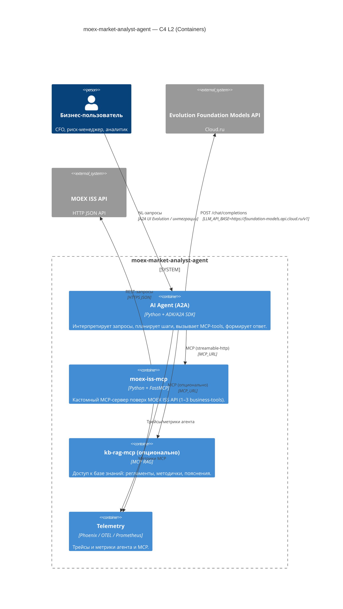
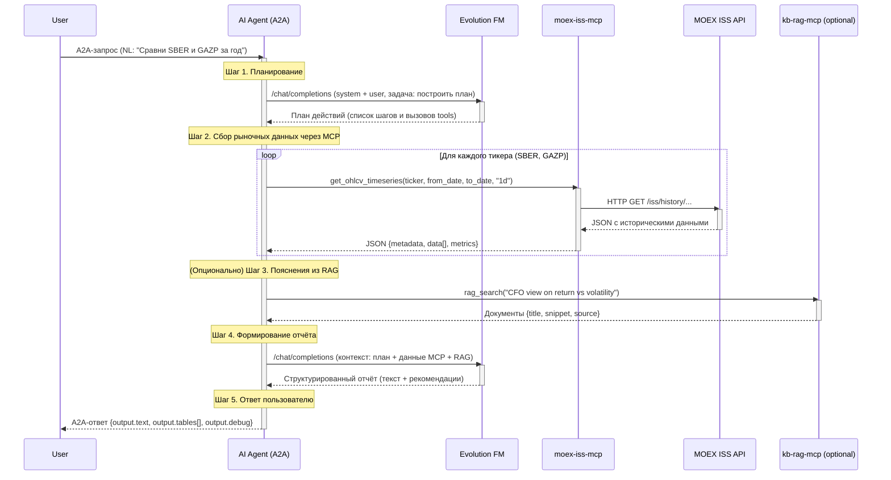

# Архитектура moex-market-analyst-agent

## 1. Назначение и контекст

**moex-market-analyst-agent** — бизнес-ориентированный AI-агент для анализа российского фондового рынка (акции, индексы, облигации) на платформе **Cloud.ru Evolution AI Agents**.

Агент:

- принимает запросы на естественном языке (через A2A-интерфейс);
- использует **Evolution Foundation Models** по официальному API `https://foundation-models.api.cloud.ru/v1/`;
- получает рыночные данные через **кастомный MCP-сервер поверх MOEX ISS API**;
- при необходимости обращается к дополнительным MCP (например, RAG MCP);
- формирует человекочитаемые отчёты и рекомендации для финансовых ролей.

Решение спроектировано в соответствии с:

- ТЗ трека **MCP for Business AI Transformation**;
- Q&A с организаторами хакатона;
- документацией **Cloud.ru Evolution AI Agents / Foundation Models**.

---

## 2. Бизнес-сценарии и пользователи

### 2.1. Целевая аудитория

- CFO / финансовый директор.
- Риск-менеджер / казначей.
- Инвестиционный аналитик / портфельный менеджер.
- Продвинутый частный инвестор (опционально, B2C-вариант).

### 2.2. Типовые сценарии

1. **Быстрый обзор тикера**

   > «Что происходит с акциями SBER за последний год?»

   Агент поднимает историю цен и объёмов, считает ключевые метрики (доходность, волатильность, обороты), выдаёт краткий отчёт.

2. **Сравнение инструментов**

   > «Сравни акции SBER и GAZP за последний год и дай вывод для инвесткомитета.»

   Агент получает OHLCV по обоим тикерам, считает метрики, строит сравнительную таблицу и текстовый вывод.

3. **Анализ индекса**

   > «Разбери индекс IMOEX: какие бумаги сейчас создают основной риск?»

   Агент выгружает состав индекса, считает базовые показатели по бумагам, подсвечивает рискованные.

4. **Анализ портфеля (расширение)**

   > «Вот портфель: [список тикеров]. Оцени риск/доходность и предложи ребалансировку.»

---

## 3. Ограничения хакатона и среды

### 3.1. Платформа и LLM

- Все компоненты (агент и MCP) **обязаны** быть развёрнуты в **Cloud.ru Evolution AI Agents**.
- Единственный допустимый LLM-провайдер в прод-версии — **Evolution Foundation Models**:
  - `LLM_API_BASE = https://foundation-models.api.cloud.ru/v1/`.
- Внешние LLM API (OpenAI, DeepSeek, Anthropic и т.п.) **запрещены** в финальной сдаче:
  - допустимы только локально/для отладки, но не в прод-конфигурации.

### 3.2. Доступ к данным

- Допустимы только:
  - официальные публичные API (например, **MOEX ISS API**),
  - либо свои/корпоративные API (включая on-prem), задокументированные и вызываемые из MCP.
- Прямой web-срапинг (HTML, Selenium/BS4 и т.п.) из агента или MCP — **запрещён**.

### 3.3. MCP

- Минимум один **кастомный MCP-сервер**, разработанный командой.
- MCP должен быть реализован на базе **FastMCP / modelcontextprotocol**.
- MCP реализует 1–3+ **осмысленных бизнес-инструмента**, а не просто «HTTP GET-wrapper».
- Все аргументы и ответы tools имеют строгие схемы (Pydantic/JSON Schema).
- Обязательна корректная обработка ошибок (timeout, сетевые ошибки, 4xx/5xx, валидация входа).

### 3.4. Безопасность и секреты

- Все секреты (ключи, токены, пароли) хранятся:
  - только в **Secret Manager** и/или переменных окружения Cloud.ru;
  - **не** хардкодятся в репозитории.
- Логи не должны содержать секреты в открытом виде.

---

## 4. Обзор архитектуры (C4 Level 2)

### 4.1. Контейнерная диаграмма

---

## 5. Компоненты

### 5.1. AI Agent (A2A)

**Роль:**

- Принимает NL-запросы пользователя.
- Проводит лёгкое планирование (разбиение задачи на шаги / tools).
- Вызывает MCP-tools `moex-iss-mcp` (и при необходимости RAG MCP).
- Формирует человекочитаемый ответ и структурированные таблицы.

**Стек:**

- Python 3.12.
- Google **ADK** + **A2A SDK** (шаблон `lab2-adk-agent`).
- OpenAI-совместимый клиент к Foundation Models (`/chat/completions`).

**Переменные окружения (минимум):**

- Идентификация агента:

  - `AGENT_NAME=moex-market-analyst-agent`
  - `AGENT_DESCRIPTION=AI-агент для анализа рынка акций Мосбиржи`
  - `AGENT_VERSION=1.0.0`
  - `AGENT_SYSTEM_PROMPT` — системный промпт (EN), описывающий роль, ограничения, инструменты.

- LLM / FM:

  - `LLM_API_BASE=https://foundation-models.api.cloud.ru/v1`
  - `LLM_MODEL=<имя модели из каталога FM>`
  - `LLM_API_KEY` или `EVOLUTION_SERVICE_ACCOUNT_KEY_ID` + `EVOLUTION_SERVICE_ACCOUNT_KEY_SECRET`
  - `LLM_TEMPERATURE`, `LLM_MAX_TOKENS`

- MCP:

  - `MCP_URL=http://moex-iss-mcp:8000/mcp[,http://kb-rag-mcp:8000/mcp]`
  - `MCP_REQUEST_TIMEOUT=10`
  - `MCP_MAX_RETRIES=2`

- Наблюдаемость:

  - `ENABLE_PHOENIX=true/false`
  - `PHOENIX_ENDPOINT=...`
  - `PHOENIX_PROJECT_NAME=moex-market-analyst`
  - `ENABLE_MONITORING=true/false`
  - `OTEL_ENDPOINT=...`

**Формат A2A-взаимодействия** (формальный JSON-контракт вынесен в `SPEC_moex-iss-mcp.md` / раздел A2A).

Высокоуровнево:

- Вход: JSON с массивом сообщений (`messages`) и метаданными.
- Выход: JSON с полями:

  - `output.text` — итоговое текстовое резюме;
  - `output.tables[]` — табличные данные (для UI/отчётов);
  - `output.debug` — опциональный блок (план, tool_calls, сырой ответ LLM).

#### 5.1.5. Agent Card (A2A)

Агент обязан публиковать корректный **Agent Card** в соответствии со спецификацией A2A Evolution AI Agents. Agent Card как минимум содержит:

- идентификатор агента (`AGENT_NAME`, `AGENT_VERSION`);

- человекочитаемое описание (`AGENT_DESCRIPTION`);

- сведения о поддерживаемых протоколах (HTTP + JSON, A2A);

- информацию об аутентификации (использование сервисного аккаунта Evolution);

- список задействованных MCP-серверов (URI из `MCP_URL`);

- ограничения и особенности (например, домен данных — рынок Мосбиржи, только чтение).

Agent Card используется платформой и внешними клиентами для автоматического обнаружения возможностей агента.

### 5.2. MCP-сервер `moex-iss-mcp`

**Роль:**

- Единственная точка, через которую агент получает данные MOEX ISS.
- Инкапсулирует протокол ISS, rate limiting, обработку ошибок.
- Даёт **бизнес-ориентированные** инструменты (не сырые REST-эндпоинты).

**Стек:**

- Python 3.12
- **FastMCP / modelcontextprotocol** с транспортом `streamable-http`;
  сервер запускается с параметром `transport="streamable-http"`.
- HTTP-клиент (`httpx`/`requests`) с тайм-аутами и ретраями

**Tools (минимум):**

- `get_security_snapshot`
- `get_ohlcv_timeseries`
- `get_index_constituents_metrics`

Подробный контракт (Pydantic-модели, JSON-схемы, формат ошибок) вынесен в `SPEC_moex-iss-mcp.md`.

**Переменные окружения:**

- `PORT=8000`
- `MOEX_ISS_BASE_URL=https://iss.moex.com/iss/`
- `MOEX_ISS_RATE_LIMIT_RPS=5`
- `MOEX_ISS_TIMEOUT_SECONDS=10`
- `ENABLE_MONITORING=true/false`
- `OTEL_ENDPOINT=...`
- `OTEL_SERVICE_NAME=moex-iss-mcp`
- (опционально) `MOEX_API_KEY=...`

**HTTP-эндпоинты MCP-сервера:**

- `/mcp` — MCP-транспорт (streamable-http).
- `/health` — healthcheck (`{"status": "ok"}`).
- `/metrics` — Prometheus-метрики.

### 5.3. Дополнительные MCP (опционально)

- `kb-rag-mcp` — RAG MCP для текстового контекста:

  - tool `rag_search(query: str, top_k: int = 5)` → список документов `{title, snippet, source}`.

- Агент получает:

  - структурированные данные от `moex-iss-mcp`;
  - текстовые пояснения от RAG MCP.

### 5.4. Наблюдаемость

- Логирование:

  - входные запросы A2A (без секретов);
  - вызовы MCP и ошибки.

- Метрики:

  - `tool_calls_total{tool=...}`;
  - `tool_errors_total{tool=...,error_type=...}`;
  - `mcp_http_latency_seconds`.

- Трейсы (OTEL + Phoenix) для:

  - цепочек LLM-вызовов;
  - MCP-вызовов.

---

## 6. Основной сценарий (sequence diagram)

Сценарий:

> «Сравни акции SBER и GAZP за последний год и подготовь отчёт для инвесткомитета.»

---

## 7. Связанные документы

- `REQUIREMENTS_moex-market-analyst-agent.md` — формализованные требования (FR/NFR/платформенные).
- `SPEC_moex-iss-mcp.md` — формальный контракт MCP, JSON-схемы, tools.json, A2A JSON-схемы.
