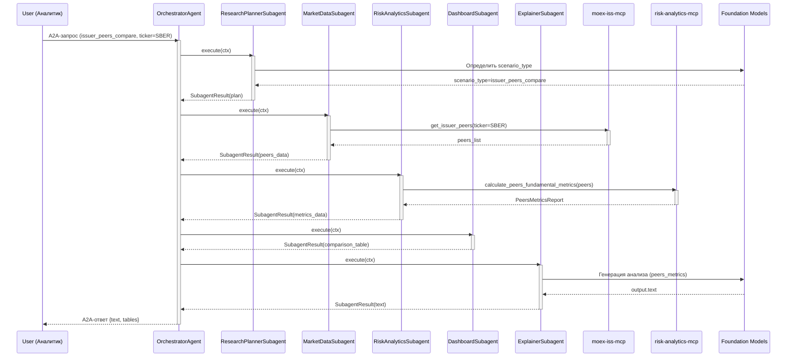
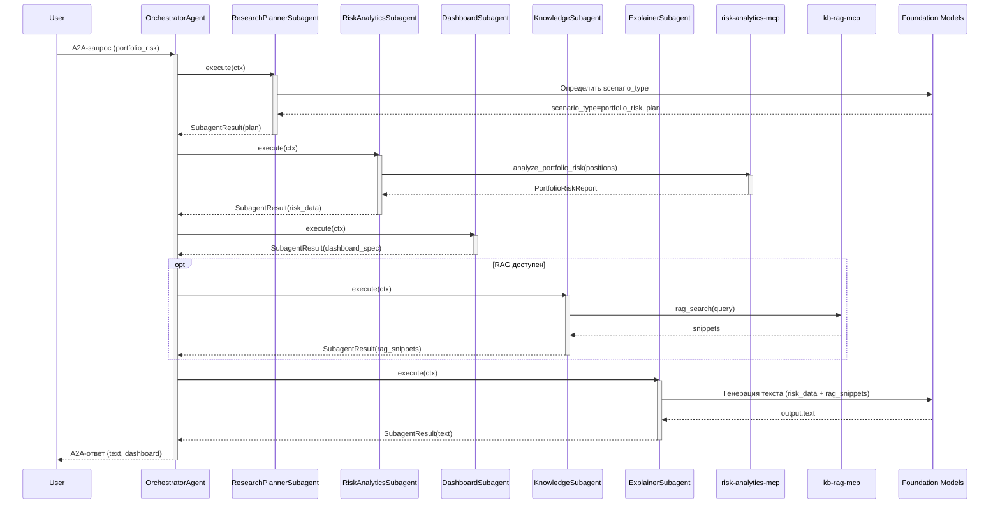
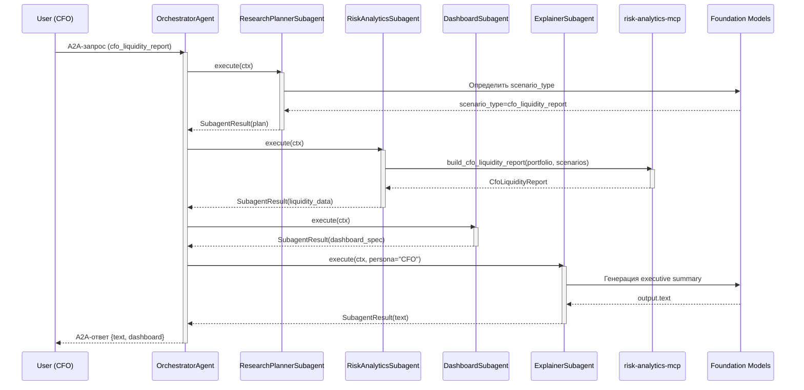

# Сценарии 5/7/9: issuer_peers_compare, portfolio_risk, cfo_liquidity_report

## 1. Назначение документа

Этот документ описывает бизнес-сценарии:

- **5. `issuer_peers_compare`** — аналитик сравнивает компанию с пирами по ключевым мультипликаторам и рисковым метрикам.

- **7. `portfolio_risk`** — риск-аналитик/PM смотрит на совокупные риски портфеля.

- **9. `cfo_liquidity_report`** — CFO получает отчёт по ликвидности и устойчивости портфеля/группы активов с несколькими стресс-сценариями.

Документ фиксирует:

- формальные **описания сценариев** (actor, intent, входы/выходы);

- **цепочки вызовов MCP** (agent → `moex-iss-mcp` → `risk-analytics-mcp`);

- **JSON-контракты** ключевых tools;

- привязку к **`ScenarioTemplate`**, которая используется планировщиком агента.

---

## 2. Формальные описания сценариев

### 2.1. Scenario 5 — `issuer_peers_compare`

**Actor:** бизнес-аналитик / инвестиционный аналитик.  
**Intent:** понять, насколько конкретный эмитент выглядит дорого/дёшево и рискованно относительно пиров.

**Примеры запросов пользователя:**

- «Покажи, как Сбер выглядит относительно пиров по P/E и ROE».

- «Сравни НЛМК с ближайшими аналогами по мультипликаторам и долговой нагрузке».

**Входы (high-level):**

- идентификатор эмитента: `ticker` / `isin` / `issuer_id` (MOEX),

- опционально: фильтр по сектору/индексу, ограничение по количеству пиров.

**Выходы (high-level):**

- таблица пиров с ключевыми метриками (P/E, EV/EBITDA, ROE, NetDebt/EBITDA, див. доходность);

- ранжирование текущего эмитента относительно пиров;

- текстовый вывод для аналитика (LLM-объяснение).

**Цепочка MCP (Multi-Agent):**

1. OrchestratorAgent → ResearchPlannerSubagent
   - определяет `scenario_type = issuer_peers_compare`, строит план.

2. OrchestratorAgent → MarketDataSubagent → `moex-iss-mcp.get_issuer_peers`
   - по `ticker/isin` получает список пиров и базовые фичи по каждому эмитенту.

3. OrchestratorAgent → RiskAnalyticsSubagent → `risk-analytics-mcp.calculate_peers_fundamental_metrics`
   - нормализует и досчитывает мультипликаторы/метрики.

4. OrchestratorAgent → DashboardSubagent
   - формирует таблицу сравнения пиров для UI.

5. OrchestratorAgent → ExplainerSubagent → LLM
   - строит человекочитаемый вывод («эмитент в верхнем квартиле по ROE, но торгуется с дисконтом по P/E»).

**Sequence Diagram (issuer_peers_compare):**



---

### 2.2. Scenario 7 — `portfolio_risk`

**Actor:** риск-менеджер / портфельный управляющий.  
**Intent:** получить компактную, но содержательную картину рисков портфеля: концентрации, чувствительность к базовым факторам рынка, простые стресс-сценарии.

**Примеры запросов:**

- «Проанализируй риски моего портфеля, который я сейчас загружу».

- «Насколько мой портфель уязвим к падению индекса IMOEX на 10% и девальвации рубля на 20%?».

**Входы (high-level):**

- структура портфеля:

  - `positions[]` (ticker/isin, количество/номинал, валюта, тип инструмента),

- опционально: риск-параметры (целевой VaR-лимит, лимиты по концентрации и т.д.).

**Выходы (high-level):**

- срезы концентрации (по эмитенту, сектору, классу активов, валюте),

- базовые риск-метрики (vol proxy, «VaR-лайт», duration для облигаций),

- результат 2–3 фиксированных стресс-сценариев (Equity Crash, FX Shock, Rate Hike),

- список «красных флагов» и рекомендаций для PM.

**Реализация в `risk-analytics-mcp` (MVP):**

- В `compute_portfolio_risk_basic` добавлен блок `stress_results[]` с пресетами `equity_-10_fx_+20`, `rates_+300bp`, `credit_spreads_+150bp` (используются агрегаты `aggregates.*` и дюрация).  
- Параметрический `var_light` на основе волатильности портфеля/референсной волатильности (`confidence_level`, `horizon_days`, `reference_volatility_pct`).  
- Вход теперь принимает `aggregates`, `stress_scenarios` (если нужно выбрать подмножество) и `var_config`.

**Цепочка MCP (Multi-Agent):**

1. OrchestratorAgent → ResearchPlannerSubagent
   - определяет `scenario_type = portfolio_risk`, строит план.

2. OrchestratorAgent → RiskAnalyticsSubagent → `risk-analytics-mcp.analyze_portfolio_risk`
   - на вход отдаётся JSON-портфель; на выходе — структурированный risk-report.

3. **(опционально)** OrchestratorAgent → RiskAnalyticsSubagent → `risk-analytics-mcp.suggest_rebalance`
   - строит детерминированное предложение ребалансировки (без LLM-магии).

4. OrchestratorAgent → DashboardSubagent
   - формирует `RiskDashboardSpec` для UI.

5. **(опционально)** OrchestratorAgent → KnowledgeSubagent → `kb-rag-mcp.rag_search`
   - получает методические пояснения.

6. OrchestratorAgent → ExplainerSubagent → LLM
   - упаковывает результат в понятный текст с акцентом на ключевые выводы.

**Sequence Diagram (portfolio_risk):**



#### Вспомогательный инструмент `compute_correlation_matrix`

- **Назначение:** построение матрицы корреляций дневных доходностей для top-N бумаг портфеля (drill-down по риск-профилю).
- **Вход:**
  - `tickers[]` — минимум два уникальных тикера, нормализуются в верхний регистр;
  - `from_date`, `to_date` — окно дат, проверяется по лимиту глубины (`RISK_MAX_LOOKBACK_DAYS`).
- **Выход:**
  - `tickers[]` в порядке расчёта;
  - `matrix[][]` — квадратная симметричная матрица, единицы на диагонали, значения в диапазоне [-1, 1];
  - `metadata` — `from_date`, `to_date`, `method="pearson"`, `num_observations`, `iss_base_url`.
- **Ошибки:**
  - `TOO_MANY_TICKERS` — если `len(tickers) > RISK_MAX_CORRELATION_TICKERS` (дефолт 20, задаётся `RISK_MAX_CORRELATION_TICKERS`);
  - `INVALID_TICKER`, `DATE_RANGE_TOO_LARGE`, `ISS_TIMEOUT`, `ISS_5XX` — маппинг исключений SDK;
  - `INSUFFICIENT_DATA` — нет общих дат/наблюдений либо нулевая дисперсия ряда;
  - `VALIDATION_ERROR` — пустые/дубликатные тикеры, `to_date < from_date`.
- **Поведение:**
  - OHLCV грузятся через `IssClient.get_ohlcv_series` (интервал 1d);
  - дневные доходности считает `calculations.returns`, корреляции — `calculations.correlation` (Пирсон);
  - лимиты и конфиг: `RISK_MAX_CORRELATION_TICKERS`, `RISK_MAX_LOOKBACK_DAYS`, `MOEX_ISS_BASE_URL`.

---

### 2.3. Scenario 9 — `cfo_liquidity_report`

**Actor:** CFO / финансовый директор.  
**Intent:** увидеть, что будет с ликвидностью, ковенантами и ключевыми метриками при нескольких стресс-сценариях, и получить рекомендации.

**Примеры запросов:**

- «Сделай отчёт для CFO по ликвидности портфеля на 12 месяцев вперёд со стресс-сценариями».

- «Покажи, выдержим ли мы падение рынка на 15% и рост ставок на 3 п.п. по ковенантам».

**Входы (high-level):**

- тот же портфель, что в сценарии 7,

- горизонты и сценарии (если пользователь не задаёт явно — используются пресеты):

  - `base_case`,

  - `equity_-10_fx_+20`,

  - `rates_+300bp`.

**Выходы (high-level):**

- агрегированный отчёт срезами, понятными CFO:

  - ликвидность по корзинам (0–7 дней, 8–30, 31–90, 90+),

  - долговая нагрузка, coverage-метрики на горизонте,

  - простые ковенант-чекеры (условные правила).

- рекомендации и предупреждения («при сценарии X риск нарушения ковенантов по…»).

**Цепочка MCP (Multi-Agent):**

1. OrchestratorAgent → ResearchPlannerSubagent
   - определяет `scenario_type = cfo_liquidity_report`, строит план.

2. OrchestratorAgent → RiskAnalyticsSubagent → `risk-analytics-mcp.build_cfo_liquidity_report`
   - агрегирует и считает всё в одном tool.

3. OrchestratorAgent → DashboardSubagent
   - формирует `RiskDashboardSpec` с ликвидностными виджетами.

4. **(опционально)** OrchestratorAgent → KnowledgeSubagent → `kb-rag-mcp.rag_search`
   - получает регламенты по ликвидности и ковенантам.

5. OrchestratorAgent → ExplainerSubagent → LLM (persona: CFO)
   - подача в стиле «executive summary + key risks + next steps».

**Sequence Diagram (cfo_liquidity_report):**



---

## 3. Привязка к ScenarioTemplate

Для планировщика используется структура `ScenarioTemplate` (хранится в JSON/YAML, используется агентом):

```json
{
  "id": "portfolio_risk",
  "version": "1.0.0",
  "actor": "risk_manager",
  "intent": "analyze overall portfolio risk and key concentrations",
  "entrypoints": [
    "проанализируй риски портфеля",
    "оценить риск портфеля",
    "портфельный риск"
  ],
  "required_tools": ["risk-analytics-mcp.analyze_portfolio_risk"],
  "optional_tools": ["risk-analytics-mcp.suggest_rebalance"],
  "inputs_schema_ref": "#/components/schemas/PortfolioRiskInput",
  "output_schema_ref": "#/components/schemas/PortfolioRiskReport"
}
```

Аналогичные записи создаются для:

- `issuer_peers_compare` → `IssuerPeersCompareInput` / `IssuerPeersCompareReport`;

- `cfo_liquidity_report` → `CfoLiquidityReportInput` / `CfoLiquidityReport`.

---

## 4. JSON-контракты MCP (упрощённо)

### 4.1. `risk-analytics-mcp.analyze_portfolio_risk`

**Request (schema `PortfolioRiskInput`):**

```json
{
  "portfolio_id": "string (optional)",
  "base_currency": "RUB",
  "positions": [
    {
      "ticker": "SBER",
      "isin": "RU0009029540",
      "instrument_type": "share",
      "quantity": 1000,
      "price": 270.5,
      "currency": "RUB"
    }
  ],
  "risk_prefs": {
    "target_var_limit": 0.1,
    "max_issuer_weight": 0.15,
    "max_sector_weight": 0.3
  }
}
```

**Response (schema `PortfolioRiskReport` — high-level):**

```json
{
  "as_of": "2025-12-10T10:00:00Z",
  "base_currency": "RUB",
  "totals": {
    "portfolio_value": 10000000.0,
    "var_light": 0.08,
    "expected_shortfall_light": 0.12
  },
  "concentrations": {
    "by_issuer": [{ "issuer": "SBER", "weight": 0.18, "breach": true }],
    "by_sector": [{ "sector": "FIN", "weight": 0.35, "breach": true }],
    "by_currency": [{ "currency": "RUB", "weight": 0.7, "breach": false }]
  },
  "stress_scenarios": [
    {
      "id": "equity_-10_fx_+20",
      "description": "Падение акций на 10%, ослабление RUB на 20%",
      "pnl": -1200000.0,
      "max_drawdown": 0.14
    }
  ],
  "flags": [
    {
      "severity": "high",
      "code": "ISSUER_CONCENTRATION",
      "message": "Концентрация по эмитенту SBER превышает лимит 15%"
    }
  ]
}
```

---

### 4.2. `risk-analytics-mcp.suggest_rebalance`

**Request (schema `RebalanceInput`):**

```json
{
  "portfolio": { "$ref": "#/components/schemas/PortfolioRiskInput" },
  "constraints": {
    "max_turnover": 0.2,
    "transaction_cost_bps": 10,
    "keep_asset_classes": true
  }
}
```

**Response (schema `RebalanceProposal`):**

```json
{
  "target_risk": {
    "var_light": 0.06
  },
  "orders": [
    {
      "ticker": "SBER",
      "side": "sell",
      "quantity": 200
    },
    {
      "ticker": "GAZP",
      "side": "buy",
      "quantity": 150
    }
  ],
  "summary": {
    "turnover": 0.18,
    "expected_var_reduction": 0.02
  }
}
```

---

### 4.3. `risk-analytics-mcp.build_cfo_liquidity_report`

**Request (schema `CfoLiquidityReportInput`):**

```json
{
  "portfolio": { "$ref": "#/components/schemas/PortfolioRiskInput" },
  "horizon_months": 12,
  "scenarios": ["base_case", "equity_-10_fx_+20", "rates_+300bp"]
}
```

**Response (schema `CfoLiquidityReport` — high-level):**

```json
{
  "as_of": "2025-12-10",
  "horizon_months": 12,
  "liquidity_buckets": [
    { "bucket": "0-7d", "share": 0.25 },
    { "bucket": "8-30d", "share": 0.4 },
    { "bucket": "31-90d", "share": 0.2 },
    { "bucket": "90d+", "share": 0.15 }
  ],
  "scenarios": [
    {
      "id": "equity_-10_fx_+20",
      "liquidity_ratio": 1.3,
      "covenant_breaches": [
        {
          "code": "NET_DEBT_EBITDA_LIMIT",
          "description": "Превышен лимит NetDebt/EBITDA > 3.5x"
        }
      ]
    }
  ],
  "summary_findings": [
    "Даже при падении рынка на 10% ликвидность в горизонте 0–30 дней остаётся достаточной.",
    "В стресс-сценарии equity_-10_fx_+20 появляется риск нарушения ковенанта NetDebt/EBITDA."
  ]
}
```

---

## 5. Привязка к MCP-серверам

- Все численные расчёты и бизнес-правила по рискам/ликвидности живут в **`risk-analytics-mcp`**.

- Доступ к сырым данным MOEX (котировки, справочники, отчётность) живёт в отдельном **`moex-iss-mcp`** и инкапсулирован внутри `risk-analytics-mcp` как data-provider.

- Агент остаётся тонким: он выбирает сценарий по `ScenarioTemplate`, оркестрирует вызовы tools и формирует LLM-объяснения под нужную персону (аналитик / риск-менеджер / CFO).
