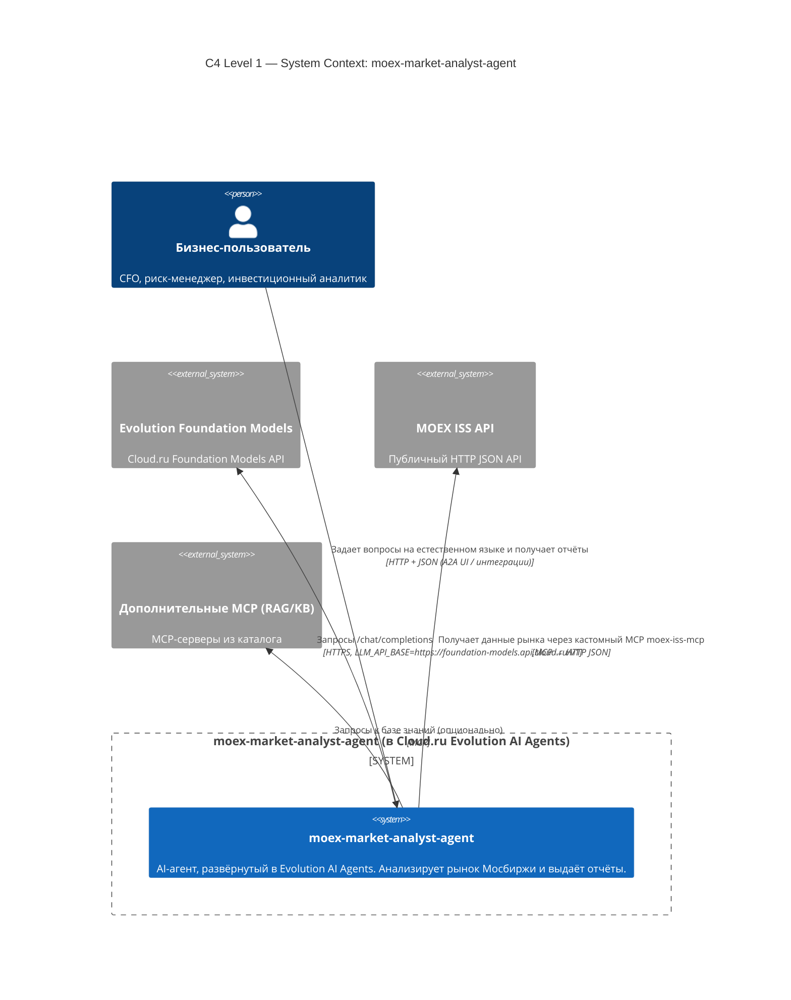

```mermaid
C4Context
    title C4 Level 1 — System Context: moex-market-analyst-agent

    Person(user, "Бизнес-пользователь", "CFO, риск-менеджер, инвестиционный аналитик")

    System_Boundary(sys, "moex-market-analyst-agent (в Cloud.ru Evolution AI Agents)") {
        System(agent_system, "moex-market-analyst-agent", "AI-агент, развёрнутый в Evolution AI Agents. Анализирует рынок Мосбиржи и выдаёт отчёты.")
    }

    System_Ext(fm, "Evolution Foundation Models", "Cloud.ru Foundation Models API", "LLM, используемая агентом через https://foundation-models.api.cloud.ru/v1.")
    System_Ext(moex, "MOEX ISS API", "Публичный HTTP JSON API", "Источник рыночных данных (котировки, история, индексы).")
    System_Ext(rag, "Дополнительные MCP (RAG/KB)", "MCP-серверы из каталога", "Опциональные источники текстовых знаний (методички, регламенты).")

    Rel(user, agent_system, "Задает вопросы на естественном языке и получает отчёты", "HTTP + JSON (A2A UI / интеграции)")
    Rel(agent_system, fm, "Запросы /chat/completions", "HTTPS, LLM_API_BASE=https://foundation-models.api.cloud.ru/v1")
    Rel(agent_system, moex, "Получает данные рынка через кастомный MCP moex-iss-mcp", "MCP → HTTP JSON")
    Rel(agent_system, rag, "Запросы к базе знаний (опционально)", "MCP")
```