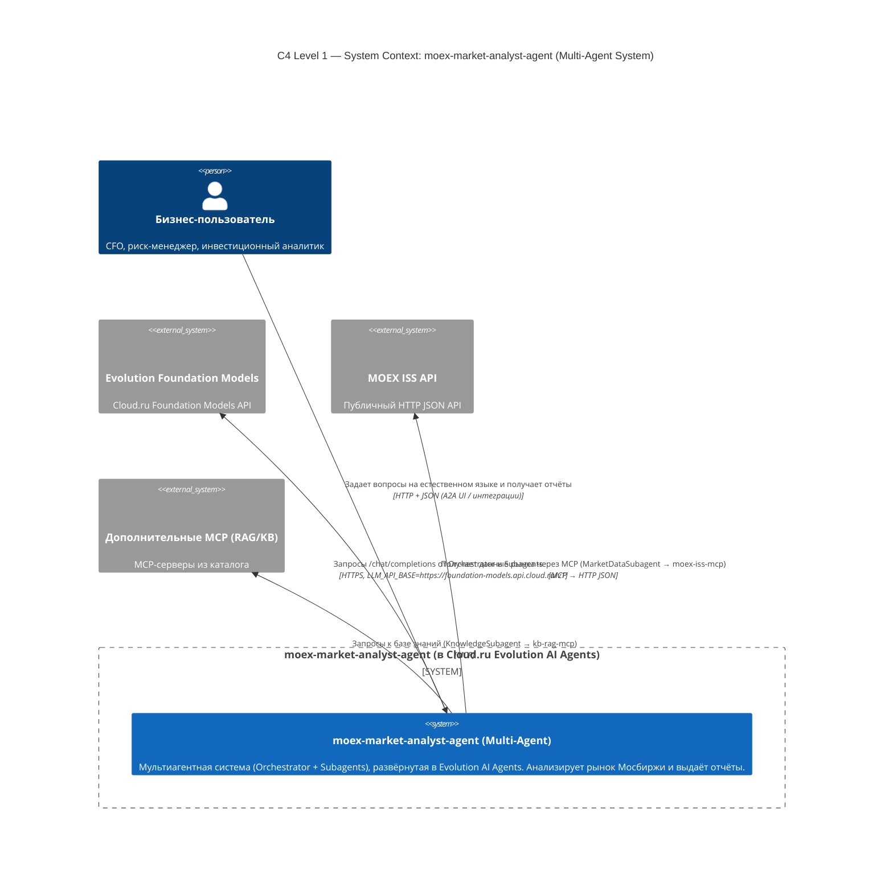

---

## Пояснение к мультиагентной архитектуре

С точки зрения внешнего мира (A2A-протокол, Agent Card) существует **один агент** `moex-market-analyst-agent`.  
Внутри он реализован по паттерну **Orchestrator + Subagents**, где:

- **OrchestratorAgent** — координирует выполнение сценария, делегирует задачи сабагентам.
- **Subagents** — специализированные агенты с изолированными промптами и ответственностью:
  - `ResearchPlannerSubagent` — определяет тип сценария и строит план.
  - `MarketDataSubagent` — работает с `moex-iss-mcp`.
  - `RiskAnalyticsSubagent` — работает с `risk-analytics-mcp`.
  - `DashboardSubagent` — формирует `RiskDashboardSpec`.
  - `ExplainerSubagent` — генерирует текстовый отчёт.
  - `KnowledgeSubagent` — работает с `kb-rag-mcp`.

Такая архитектура обеспечивает:
- изоляцию промптов и контекста между задачами;
- лучшую управляемость и тестируемость отдельных ролей;
- возможность независимого масштабирования и развития сабагентов.