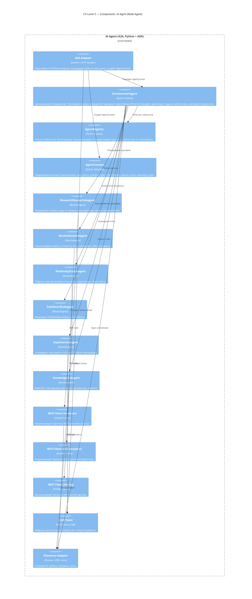

# C4 Level 3 — Components: AI Agent (Multi-Agent Architecture)

## 1. Обзор архитектуры

Агент реализован по паттерну **Orchestrator + Subagents**. Каждый сабагент — изолированный компонент с собственным промптом, ответственностью и набором доступных MCP-клиентов.



---

## 2. Описание компонентов

### 2.1. A2A Adapter

**Ответственность:**

- Единственная точка входа для HTTP/A2A-запросов.
- Валидация входящего JSON по A2A-схеме.
- Создание `AgentContext` и передача в `OrchestratorAgent`.
- Логирование запросов/ответов через Telemetry.

### 2.2. OrchestratorAgent

**Ответственность:**

- Центральный координатор мультиагентной системы.
- Получает `AgentContext`, вызывает `ResearchPlannerSubagent` для определения сценария.
- Делегирует задачи соответствующим сабагентам согласно плану.
- Агрегирует результаты и формирует финальный A2A-ответ.
- Обрабатывает ошибки сабагентов, обеспечивает graceful degradation.

**Не делает:**

- Не вызывает MCP напрямую (только через сабагентов).
- Не генерирует текст напрямую через LLM (только через сабагентов).

### 2.3. AgentRegistry

**Ответственность:**

- Хранит реестр зарегистрированных сабагентов.
- Инициализирует сабагентов с нужными зависимостями (MCP-клиенты, LLM-клиент).
- Предоставляет доступ к сабагентам по имени/роли.

### 2.4. AgentContext

**Ответственность:**

- Разделяемый контекст выполнения запроса.
- Содержит: `user_query`, `locale`, `user_role`, `scenario_type`, `plan`, `intermediate_results`, `errors`, `telemetry_span`.
- Передаётся между Orchestrator и Subagents.

---

## 3. Сабагенты (Subagents)

### 3.1. ResearchPlannerSubagent

**Роль:** Планировщик сценария.

**Ответственность:**

- Анализирует `user_query` и определяет `scenario_type` (single_security_overview, compare_securities, portfolio_risk_basic и т.д.).
- Строит план действий: какие сабагенты вызвать, в каком порядке.
- Валидирует ограничения (глубина истории, количество тикеров).

**Зависимости:** LLM Client.

### 3.2. MarketDataSubagent

**Роль:** Провайдер рыночных данных.

**Ответственность:**

- Инкапсулирует всю работу с `moex-iss-mcp`.
- Вызывает tools: `get_security_snapshot`, `get_ohlcv_timeseries`, `get_index_constituents_metrics`.
- Следит за правилами по датам (дефолты, MAX_LOOKBACK_DAYS).
- Нормализует ошибки ISS.

**Зависимости:** MCP Client (moex-iss).

### 3.3. RiskAnalyticsSubagent

**Роль:** Риск-аналитика.

**Ответственность:**

- Обёртка над `risk-analytics-mcp`.
- Вызывает tools: `compute_portfolio_risk_basic`, `compute_correlation_matrix`, `suggest_rebalance`, `build_cfo_liquidity_report`.
- Валидирует входные позиции, обрабатывает ошибки.

**Зависимости:** MCP Client (risk-analytics).

### 3.4. DashboardSubagent

**Роль:** Формирование UI-дашборда.

**Ответственность:**

- Собирает данные от MarketDataSubagent и RiskAnalyticsSubagent.
- Формирует структурированный JSON `RiskDashboardSpec` для `output.dashboard`.
- Определяет виджеты, метрики, графики, alerts.

**Зависимости:** (опционально) LLM Client для генерации структуры.

### 3.5. ExplainerSubagent

**Роль:** Генерация текстового отчёта.

**Ответственность:**

- Генерирует человекочитаемый `output.text` для разных ролей (CFO, риск-менеджер, аналитик).
- Интерпретирует метрики и данные дашборда.
- Объединяет численные данные и RAG-контекст (если доступен).

**Зависимости:** LLM Client, (опционально) данные от KnowledgeSubagent.

### 3.6. KnowledgeSubagent

**Роль:** Провайдер знаний (RAG).

**Ответственность:**

- Тонкий слой над `kb-rag-mcp`.
- Формирует запросы к базе знаний с учётом сценария и роли пользователя.
- Возвращает snippets (методики, регламенты, новости) для ExplainerSubagent.

**Зависимости:** MCP Client (kb-rag).

---

## 4. MCP Clients

Каждый MCP-клиент:

- Инкапсулирует протокол MCP (streamable-http).
- Управляет тайм-аутами и ретраями.
- Логирует вызовы через Telemetry.
- Маппит исключения в нормализованные ошибки.

| MCP Client      | Сервер             | Используется          |
| --------------- | ------------------ | --------------------- |
| mcp_client_moex | moex-iss-mcp       | MarketDataSubagent    |
| mcp_client_risk | risk-analytics-mcp | RiskAnalyticsSubagent |
| mcp_client_rag  | kb-rag-mcp         | KnowledgeSubagent     |

---

## 5. Поток выполнения (пример: portfolio_risk_basic)

```
1. A2A Adapter получает запрос → создаёт AgentContext
2. OrchestratorAgent получает AgentContext
3. OrchestratorAgent → ResearchPlannerSubagent: определить сценарий
   → scenario_type = "portfolio_risk_basic"
   → plan = [RiskAnalytics → Dashboard → (опц.) Knowledge → Explainer]
4. OrchestratorAgent → RiskAnalyticsSubagent: compute_portfolio_risk_basic
   → RiskAnalyticsSubagent → MCP Client (risk) → risk-analytics-mcp
   → результат в AgentContext.intermediate_results
5. OrchestratorAgent → DashboardSubagent: сформировать RiskDashboardSpec
   → результат в AgentContext.intermediate_results["dashboard"]
6. (Опционально) OrchestratorAgent → KnowledgeSubagent: получить методики
   → результат в AgentContext.intermediate_results["rag_snippets"]
7. OrchestratorAgent → ExplainerSubagent: сгенерировать output.text
8. OrchestratorAgent агрегирует: output.text + output.dashboard
9. A2A Adapter возвращает A2A-ответ
```
