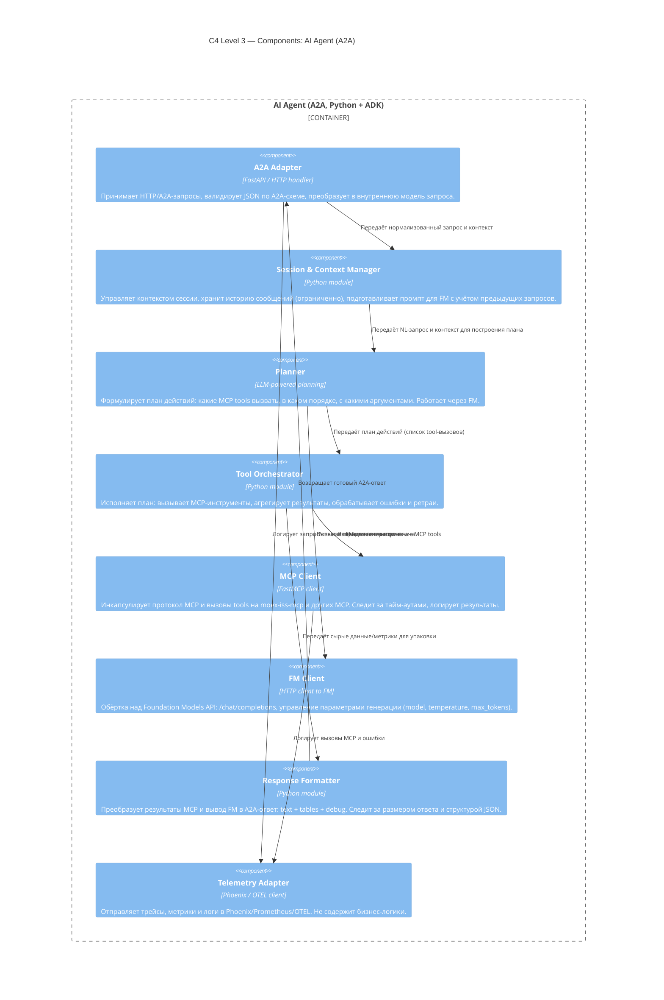

**Кратко по компонентам:**

- **A2A Adapter** — слой интеграции с платформой (HTTP + JSON, A2A протокол).
- **Planner** — единственное место, где мы используем FM для «reasoning» по плану (минимизируем число LLM-вызовов).
- **Tool Orchestrator + MCP Client** — вся работа с tools, включая обработку ошибок и ретраи, чтобы не засорять агента.
- **Response Formatter** — изолирует «как показать результат пользователю» от «как мы считаем данные».
