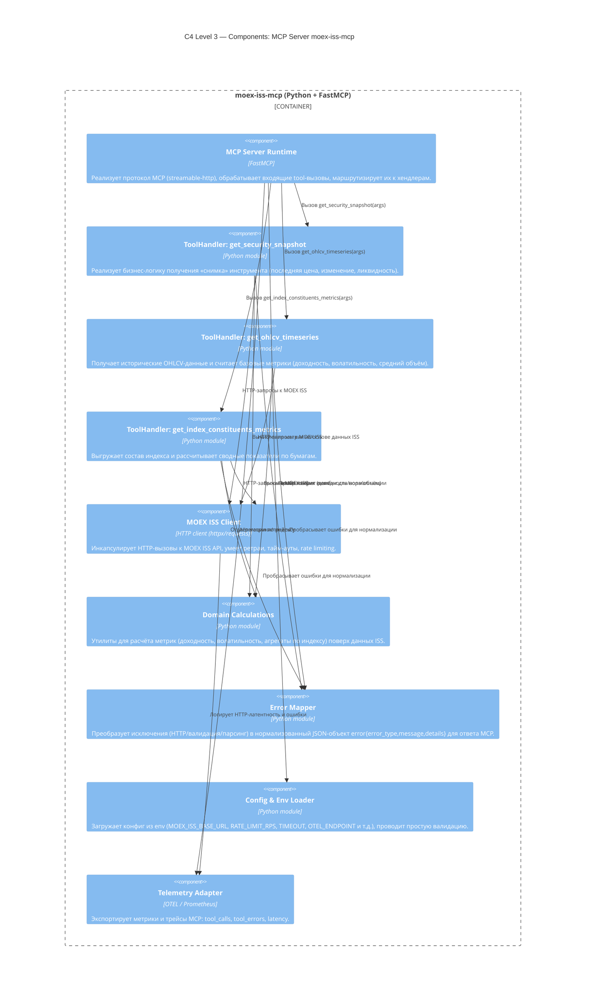

```mermaid
C4Component
    title C4 Level 3 — Components: MCP Server moex-iss-mcp

    Container_Boundary(mcp, "moex-iss-mcp (Python + FastMCP)") {

        Component(mcp_server, "MCP Server Runtime", "FastMCP", "Реализует протокол MCP (streamable-http), обрабатывает входящие tool-вызовы, маршрутизирует их к хендлерам.")

        Component(tool_snapshot, "ToolHandler: get_security_snapshot", "Python module", "Реализует бизнес-логику получения «снимка» инструмента (последняя цена, изменение, ликвидность).")

        Component(tool_ohlcv, "ToolHandler: get_ohlcv_timeseries", "Python module", "Получает исторические OHLCV-данные и считает базовые метрики (доходность, волатильность, средний объём).")

        Component(tool_index, "ToolHandler: get_index_constituents_metrics", "Python module", "Выгружает состав индекса и рассчитывает сводные показатели по бумагам.")

        Component(iss_client, "MOEX ISS Client", "HTTP client (httpx/requests)", "Инкапсулирует HTTP-вызовы к MOEX ISS API, умеет ретраи, тайм-ауты, rate limiting.")

        Component(domain_calc, "Domain Calculations", "Python module", "Утилиты для расчёта метрик (доходность, волатильность, агрегаты по индексу) поверх данных ISS.")

        Component(error_mapper, "Error Mapper", "Python module", "Преобразует исключения (HTTP/валидация/парсинг) в нормализованный JSON-объект error{error_type,message,details} для ответа MCP.")

        Component(mcp_config, "Config & Env Loader", "Python module", "Загружает конфиг из env (MOEX_ISS_BASE_URL, RATE_LIMIT_RPS, TIMEOUT, OTEL_ENDPOINT и т.д.), проводит простую валидацию.")

        Component(mcp_telemetry, "Telemetry Adapter", "OTEL / Prometheus", "Экспортирует метрики и трейсы MCP: tool_calls, tool_errors, latency.")
    }

    Rel(mcp_server, tool_snapshot, "Вызов get_security_snapshot(args)")
    Rel(mcp_server, tool_ohlcv, "Вызов get_ohlcv_timeseries(args)")
    Rel(mcp_server, tool_index, "Вызов get_index_constituents_metrics(args)")

    Rel(tool_snapshot, iss_client, "HTTP-запросы к MOEX ISS")
    Rel(tool_ohlcv, iss_client, "HTTP-запросы к MOEX ISS")
    Rel(tool_index, iss_client, "HTTP-запросы к MOEX ISS")

    Rel(tool_snapshot, domain_calc, "Вычисление метрик на основе данных ISS")
    Rel(tool_ohlcv, domain_calc, "Вычисление метрик (доходность/вола/объём)")
    Rel(tool_index, domain_calc, "Агрегации по индексу")

    Rel(tool_snapshot, error_mapper, "Пробрасывает ошибки для нормализации")
    Rel(tool_ohlcv, error_mapper, "Пробрасывает ошибки для нормализации")
    Rel(tool_index, error_mapper, "Пробрасывает ошибки для нормализации")

    Rel(mcp_server, mcp_config, "Читает конфиг и env")
    Rel(mcp_server, mcp_telemetry, "Отдаёт метрики/трейсы")
    Rel(iss_client, mcp_telemetry, "Логирует HTTP-латентность и ошибки")
```