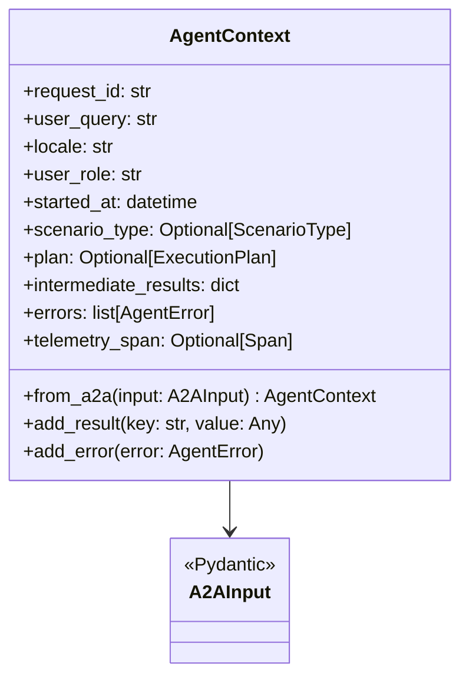
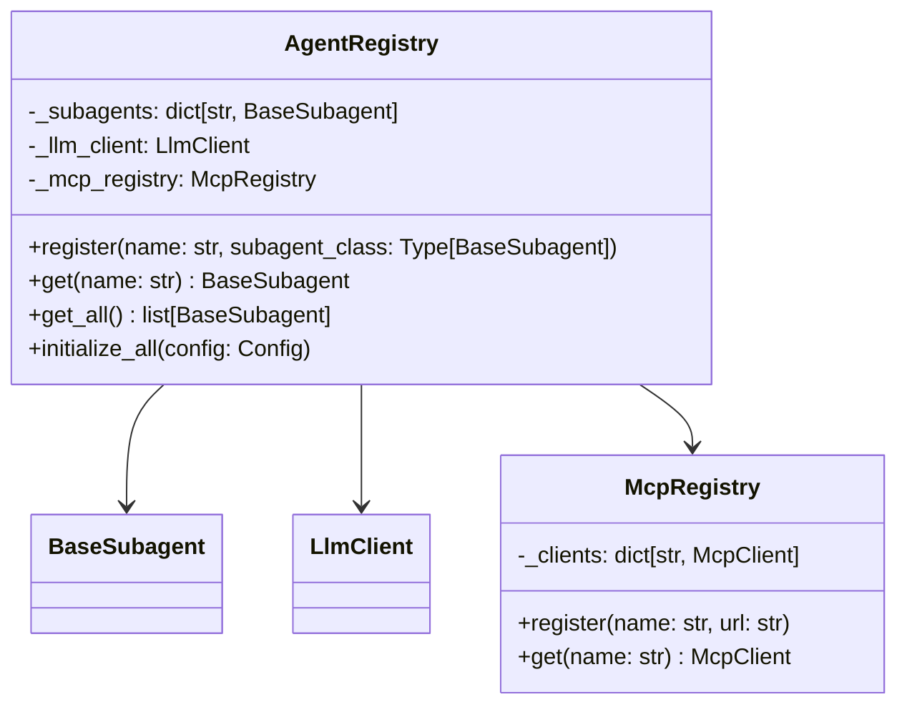
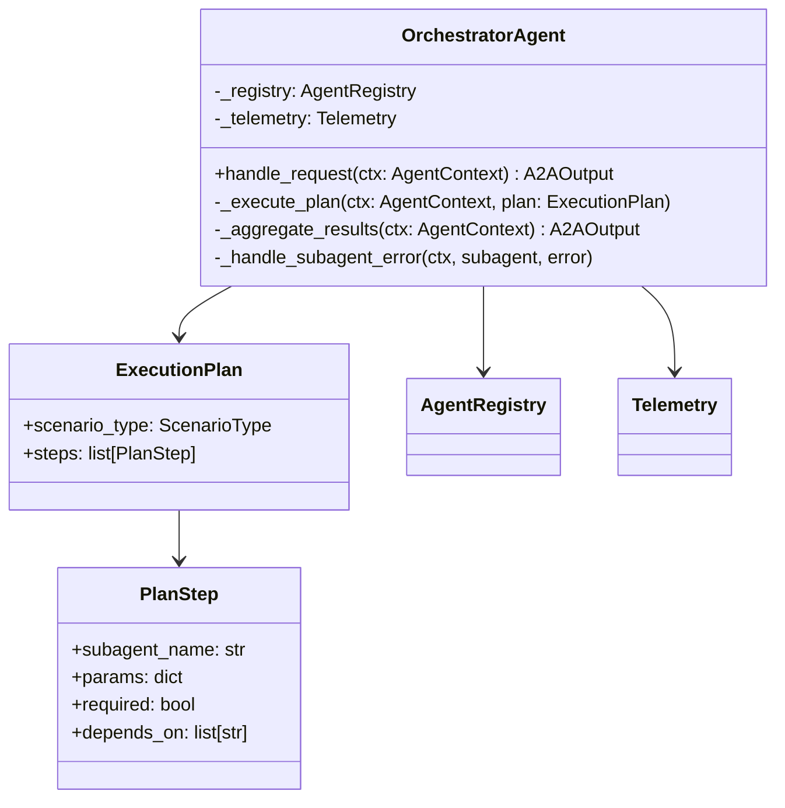
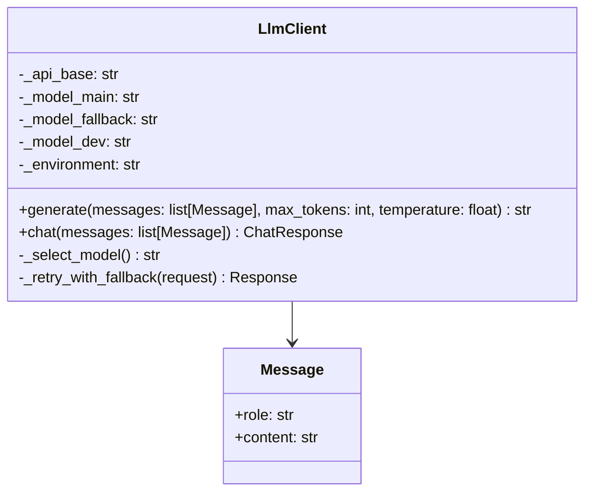
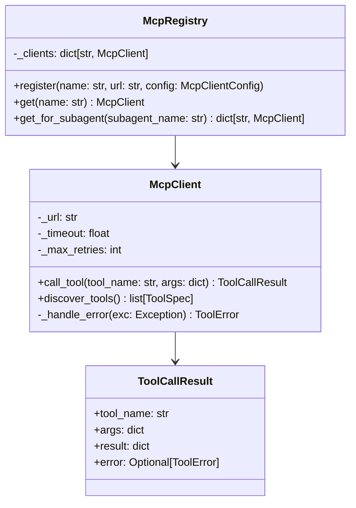
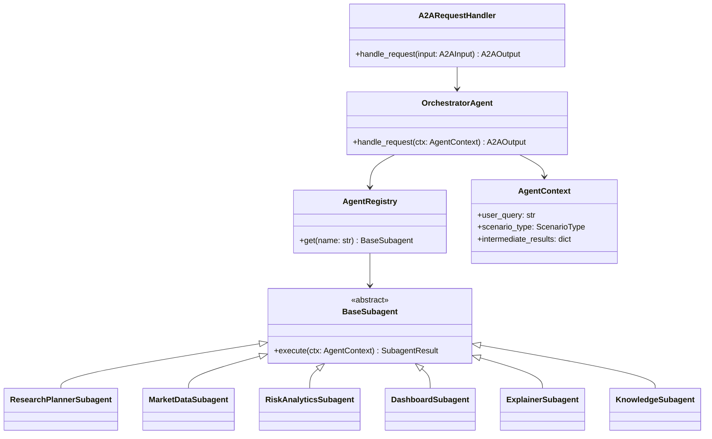

# C4 Level 4 — Code: AI Agent (Multi-Agent Architecture)

## 1. Цели уровня L4

Этот документ фиксирует **структуру пакета**, основные классы и их ответственность для мультиагентной реализации `moex-market-analyst-agent`.

Ключевые классы:
- `BaseSubagent` — абстрактный базовый класс для всех сабагентов.
- `OrchestratorAgent` — центральный координатор.
- `AgentContext` — разделяемый контекст выполнения.
- `AgentRegistry` — реестр и фабрика сабагентов.

Фреймворк: Python 3.12 + ADK/A2A SDK + FastAPI.

---

## 2. Структура пакета

```text
moex_agent/
├── __init__.py
├── config.py                # Загрузка env, базовые настройки агента
├── logging_config.py        # Настройка логирования
├── main.py                  # Точка входа (инициализация A2A-сервера)
├── a2a_api.py               # HTTP/A2A handler (маршруты, привязка к ADK)
│
├── models/
│   ├── __init__.py
│   ├── a2a.py               # Pydantic-модели A2A-входа/выхода
│   ├── scenarios.py         # ScenarioType enum, ScenarioTemplate
│   └── dashboard.py         # RiskDashboardSpec, WidgetSpec
│
├── context/
│   ├── __init__.py
│   └── agent_context.py     # AgentContext dataclass
│
├── agents/
│   ├── __init__.py
│   ├── base.py              # BaseSubagent (ABC)
│   ├── registry.py          # AgentRegistry
│   ├── orchestrator.py      # OrchestratorAgent
│   │
│   └── subagents/
│       ├── __init__.py
│       ├── research_planner.py    # ResearchPlannerSubagent
│       ├── market_data.py         # MarketDataSubagent
│       ├── risk_analytics.py      # RiskAnalyticsSubagent
│       ├── dashboard.py           # DashboardSubagent
│       ├── explainer.py           # ExplainerSubagent
│       └── knowledge.py           # KnowledgeSubagent
│
├── llm/
│   ├── __init__.py
│   ├── client.py            # LlmClient (обёртка над Foundation Models)
│   └── prompts.py           # Шаблоны промптов для сабагентов
│
├── mcp/
│   ├── __init__.py
│   ├── client.py            # McpClient (универсальный MCP-клиент)
│   ├── registry.py          # McpRegistry (реестр MCP-серверов)
│   └── types.py             # Типы для описания tools
│
├── telemetry/
│   ├── __init__.py
│   ├── phoenix_adapter.py   # Phoenix/OTEL интеграция
│   └── metrics.py           # Prometheus-метрики
│
└── errors/
    ├── __init__.py
    └── agent_errors.py      # Доменные ошибки агента
```

---

## 3. Классы и их ответственность

### 3.1. AgentContext



**AgentContext (context/agent_context.py)**

Разделяемый контекст выполнения запроса:
- Создаётся из A2A-запроса через `from_a2a()`.
- Содержит `intermediate_results` — словарь для обмена данными между сабагентами.
- Хранит список ошибок `errors` для graceful degradation.
- Передаётся в каждый сабагент при вызове.

---

### 3.2. BaseSubagent и иерархия сабагентов

```mermaid
classDiagram
    class BaseSubagent {
        <<abstract>>
        +name: str
        +description: str
        +llm_client: Optional[LlmClient]
        +mcp_clients: dict[str, McpClient]
        +execute(ctx: AgentContext) SubagentResult*
        #_get_system_prompt() str*
        #_validate_context(ctx: AgentContext)
        #_log_execution(ctx, result)
    }

    class SubagentResult {
        +success: bool
        +data: Optional[dict]
        +error: Optional[AgentError]
    }

    class ResearchPlannerSubagent {
        +execute(ctx: AgentContext) SubagentResult
        -_classify_scenario(query: str) ScenarioType
        -_build_plan(scenario: ScenarioType) ExecutionPlan
    }

    class MarketDataSubagent {
        +execute(ctx: AgentContext) SubagentResult
        -_call_get_ohlcv(ticker, from_date, to_date)
        -_call_get_snapshot(ticker)
        -_call_get_index_constituents(index_ticker)
    }

    class RiskAnalyticsSubagent {
        +execute(ctx: AgentContext) SubagentResult
        -_call_portfolio_risk(positions, params)
        -_call_correlation_matrix(tickers, dates)
        -_call_cfo_liquidity(portfolio, scenarios)
    }

    class DashboardSubagent {
        +execute(ctx: AgentContext) SubagentResult
        -_build_widgets(data) list[WidgetSpec]
        -_build_alerts(risk_report) list[AlertSpec]
    }

    class ExplainerSubagent {
        +execute(ctx: AgentContext) SubagentResult
        -_build_prompt_for_role(role: str) str
        -_generate_text(prompt: str) str
    }

    class KnowledgeSubagent {
        +execute(ctx: AgentContext) SubagentResult
        -_build_rag_query(scenario, metrics) str
        -_call_rag_search(query) list[RagSnippet]
    }

    BaseSubagent <|-- ResearchPlannerSubagent
    BaseSubagent <|-- MarketDataSubagent
    BaseSubagent <|-- RiskAnalyticsSubagent
    BaseSubagent <|-- DashboardSubagent
    BaseSubagent <|-- ExplainerSubagent
    BaseSubagent <|-- KnowledgeSubagent

    BaseSubagent --> SubagentResult
    BaseSubagent --> LlmClient
    BaseSubagent --> McpClient
```



**BaseSubagent (agents/base.py)**

Абстрактный базовый класс:
- Определяет интерфейс `execute(ctx: AgentContext) -> SubagentResult`.
- Хранит зависимости: `llm_client`, `mcp_clients`.
- Предоставляет шаблонные методы для логирования и валидации.

**SubagentResult** — результат выполнения сабагента:
- `success: bool` — успешность выполнения.
- `data: Optional[dict]` — результирующие данные.
- `error: Optional[AgentError]` — ошибка, если есть.

---

### 3.3. AgentRegistry



**AgentRegistry (agents/registry.py)**

Реестр и фабрика сабагентов:
- Регистрирует классы сабагентов.
- При инициализации создаёт экземпляры с нужными зависимостями.
- Предоставляет доступ к сабагентам по имени.

---

### 3.4. OrchestratorAgent



**OrchestratorAgent (agents/orchestrator.py)**

Центральный координатор:
- Получает `AgentContext` от A2A Adapter.
- Вызывает `ResearchPlannerSubagent` для определения сценария и плана.
- Исполняет `ExecutionPlan`: вызывает сабагентов согласно плану.
- Обрабатывает ошибки сабагентов (graceful degradation).
- Агрегирует результаты в `A2AOutput`.

---

### 3.5. LlmClient



**LlmClient (llm/client.py)**

Обёртка над Foundation Models:
- Знает про `LLM_API_BASE`, `LLM_MODEL_MAIN`, `LLM_MODEL_FALLBACK`, `LLM_MODEL_DEV`.
- Выбирает модель согласно `ENVIRONMENT`.
- Реализует retry с fallback на резервную модель.

---

### 3.6. McpClient и McpRegistry



**McpClient (mcp/client.py)**

Универсальный MCP-клиент:
- Инкапсулирует протокол MCP (streamable-http).
- Управляет тайм-аутами и ретраями.
- Маппит исключения в `ToolError`.

**McpRegistry (mcp/registry.py)**

Реестр MCP-серверов:
- Парсит `MCP_URL` из env.
- Создаёт `McpClient` для каждого сервера.
- Предоставляет клиенты для сабагентов по конфигурации.

---

## 4. Конфигурация и маппинг сабагентов на MCP

```python
# config.py
SUBAGENT_MCP_MAPPING = {
    "market_data": ["moex-iss-mcp"],
    "risk_analytics": ["risk-analytics-mcp"],
    "knowledge": ["kb-rag-mcp"],
    "research_planner": [],  # Только LLM
    "dashboard": [],         # Только данные из контекста
    "explainer": [],         # Только LLM
}
```

---

## 5. Основной поток внутри агента

```python
# Псевдокод OrchestratorAgent.handle_request
async def handle_request(self, ctx: AgentContext) -> A2AOutput:
    # 1. Определение сценария
    planner = self._registry.get("research_planner")
    plan_result = await planner.execute(ctx)
    ctx.scenario_type = plan_result.data["scenario_type"]
    ctx.plan = plan_result.data["plan"]

    # 2. Выполнение плана
    for step in ctx.plan.steps:
        subagent = self._registry.get(step.subagent_name)
        try:
            result = await subagent.execute(ctx)
            if result.success:
                ctx.add_result(step.subagent_name, result.data)
            else:
                ctx.add_error(result.error)
                if step.required:
                    break  # Критический шаг — прерываем
        except Exception as e:
            ctx.add_error(AgentError.from_exception(e))
            if step.required:
                break

    # 3. Агрегация результатов
    return self._aggregate_results(ctx)

def _aggregate_results(self, ctx: AgentContext) -> A2AOutput:
    return A2AOutput(
        output=OutputModel(
            text=ctx.intermediate_results.get("explainer", {}).get("text", ""),
            tables=ctx.intermediate_results.get("market_data", {}).get("tables", []),
            dashboard=ctx.intermediate_results.get("dashboard", {}).get("spec"),
            debug=DebugInfo(
                scenario_type=ctx.scenario_type,
                plan=ctx.plan,
                errors=ctx.errors,
            ) if Config.DEBUG_ENABLED else None
        )
    )
```

---

## 6. Telemetry и трейсинг

Каждый сабагент создаёт child-span от parent-span Orchestrator:

```python
# BaseSubagent._log_execution
async def execute(self, ctx: AgentContext) -> SubagentResult:
    with ctx.telemetry_span.child(name=f"subagent.{self.name}") as span:
        span.set_attribute("subagent.name", self.name)
        span.set_attribute("scenario_type", ctx.scenario_type)
        try:
            result = await self._do_execute(ctx)
            span.set_attribute("success", result.success)
            return result
        except Exception as e:
            span.record_exception(e)
            raise
```

---

## 7. Диаграмма классов (сводная)


