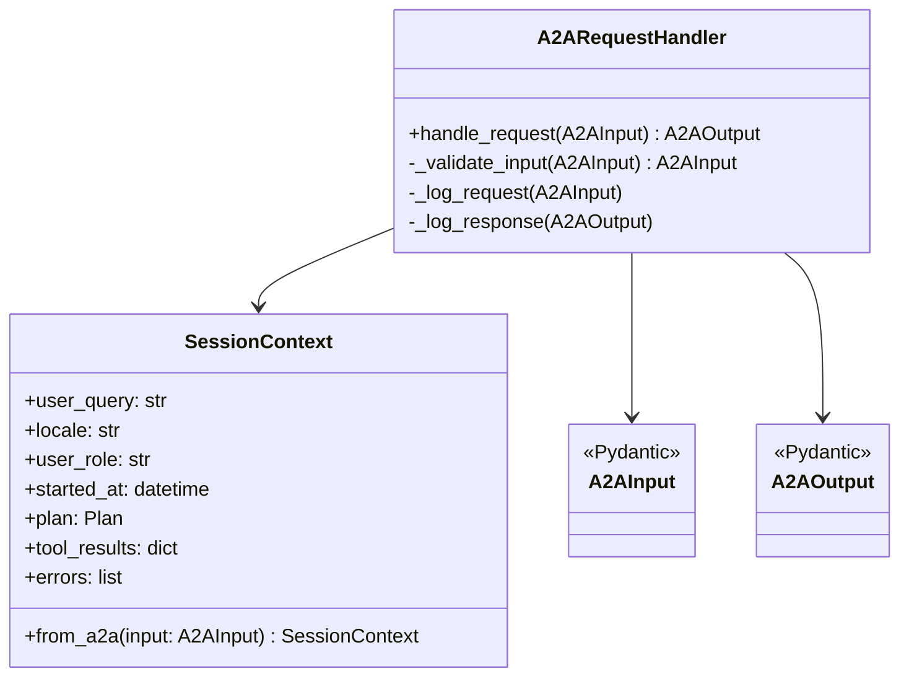
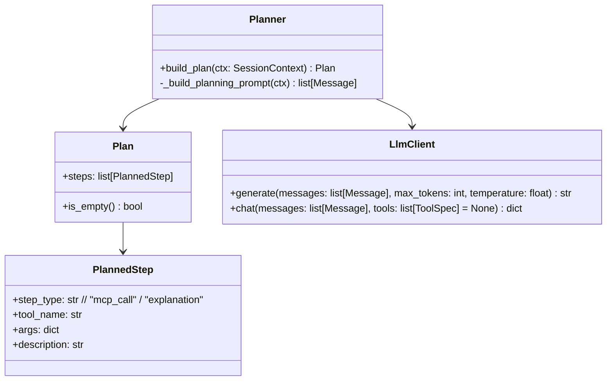
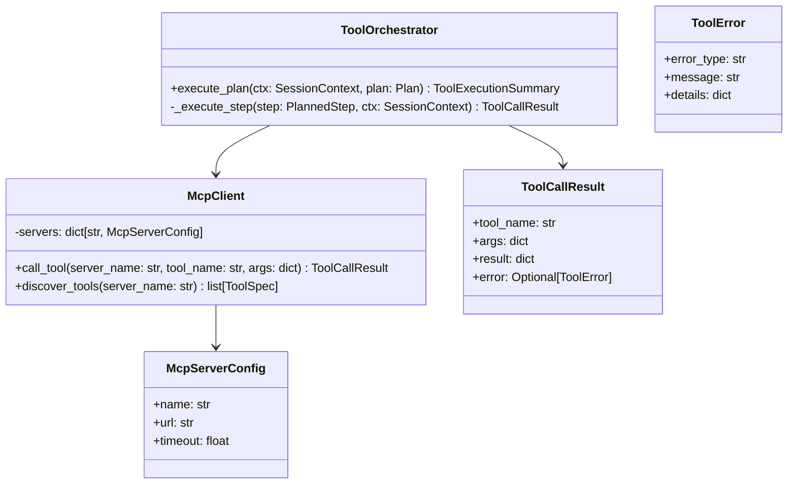
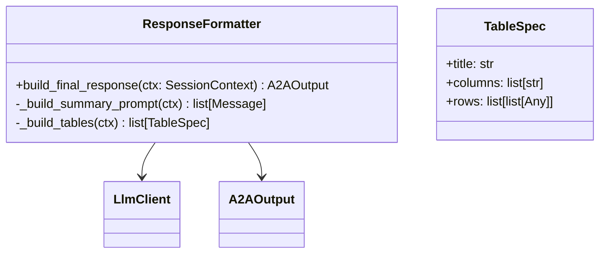
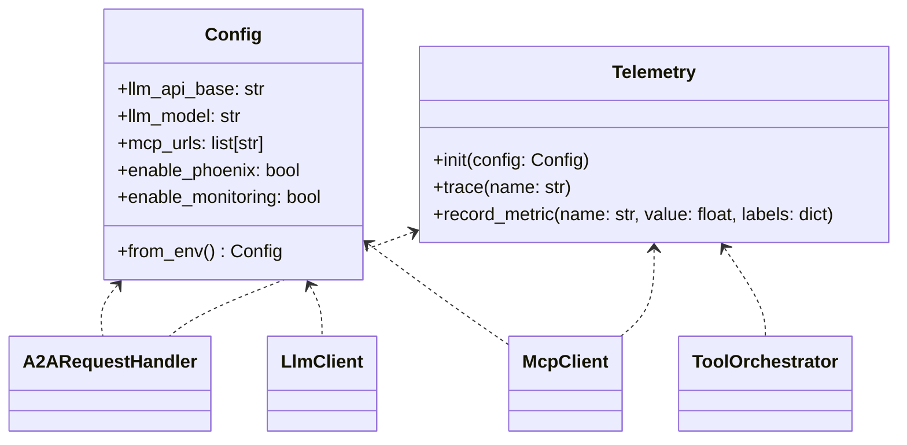

# C4 Level 4 — Code: AI Agent (A2A)

## 1. Цели уровня L4

Этот документ фиксирует **структуру пакета**, основные классы и их ответственность для AI-агента `moex-market-analyst-agent`, чтобы разработка разных людей была согласованной.

Фреймворк: Python 3.12 + ADK/A2A SDK + (FastAPI или аналог для HTTP-обвязки).

---

## 2. Структура пакета

```text

moex_agent/
**init**.py

config.py               # Загрузка env, базовые настройки агента
logging_config.py       # Настройка логирования

main.py                 # Точка входа (инициализация A2A-сервера)
a2a_api.py              # HTTP/A2A handler (маршруты, привязка к ADK)

models/
**init**.py
a2a.py                # Pydantic-модели A2A-входа/выхода
plan.py               # План (Plan, PlannedStep)
tool_results.py       # Результаты вызовов MCP-инструментов

context/
**init**.py
session.py            # SessionContext, хранение контекста запроса

llm/
**init**.py
client.py             # LlmClient (обёртка над Foundation Models)
prompts.py            # Шаблоны системного/ролей/планировщика

mcp/
**init**.py
client.py             # McpClient (registry MCP-серверов и tools)
types.py              # Типы для описания tools (имя, schema и т.д.)

planning/
**init**.py
planner.py            # Planner: формирование плана действий

orchestration/
**init**.py
tool_orchestrator.py  # ToolOrchestrator: исполнение плана через MCP
errors.py             # Domain-ошибки оркестрации

formatting/
**init**.py
response_formatter.py # ResponseFormatter: сбор финального ответа

telemetry/
**init**.py
phoenix_adapter.py    # Phoenix/OTEL интеграция
metrics.py            # Обёртка над Prometheus-метриками (если нужна)

```

---

## 3. Классы и их ответственность

### 3.1. A2A-уровень и контекст



**A2ARequestHandler (a2a_api.py)**

- Единственная публичная точка входа для AI Agents:

  - метод `handle_request(input: A2AInput) -> A2AOutput`.

- Делает:

  - валидацию входа через Pydantic;
  - создание `SessionContext`;
  - вызов `AgentService` (см. дальше);
  - логирование в telemetry.

**SessionContext (context/session.py)**

- Хранит:

  - `user_query` (строка из последнего сообщения user);
  - `locale`, `user_role` (если передали в metadata);
  - временные метки;
  - `plan`, `tool_results`, список ошибок.

- Упрощает прокидывание общих данных по слоям.

---

### 3.2. Планирование и LLM



**Planner (planning/planner.py)**

- Использует `LlmClient` и `prompts.py` для:

  - построения промпта планирования;
  - генерации списка шагов (PlannedStep).

- Отдаёт `Plan` (в простом виде — список MCP-вызовов + финальная генерация отчёта).

**LlmClient (llm/client.py)**

- Обёртка над Foundation Models:

  - знает про `LLM_API_BASE`, `LLM_MODEL`, `LLM_API_KEY`;
  - предоставляет:

    - `generate()` — простой вызов;
    - `chat()` — вызов с поддержкой tools (если понадобится).

---

### 3.3. MCP-клиент и оркестрация



**McpClient (mcp/client.py)**

- Знает о MCP-серверах из `MCP_URL` (парсит env):

  - `moex-iss-mcp`,
  - `kb-rag-mcp` (опционально).

- Отвечает за:

  - вызов конкретного tool (`call_tool`),
  - управление тайм-аутами и ретраями,
  - логирование в telemetry.

**ToolOrchestrator (orchestration/tool_orchestrator.py)**

- На вход: `SessionContext`, `Plan`.
- Для каждого шага `PlannedStep` с `step_type == "mcp_call"`:

  - вызывает `McpClient.call_tool(...)`;
  - складывает `ToolCallResult` в `ctx.tool_results`.

- Возвращает `ToolExecutionSummary`:

  - список успешных/упавших вызовов,
  - агрегированное состояние для дальнейшей LLM-генерации.

---

### 3.4. Формирование ответа



**ResponseFormatter (formatting/response_formatter.py)**

- Собирает:

  - текстовую часть (`output.text`) через LLM (с учётом `ctx.tool_results`);
  - набор таблиц (`output.tables`) из структур MCP-ответов;
  - отладочную информацию (`output.debug`) при включённом флаге.

---

### 3.5. Telemetry / Config



---

## 4. Основной поток внутри агента

Псевдокод (упрощённо):

```python
def handle_request(input: A2AInput) -> A2AOutput:
    ctx = SessionContext.from_a2a(input)
    plan = planner.build_plan(ctx)
    ctx.plan = plan

    tool_summary = tool_orchestrator.execute_plan(ctx, plan)
    ctx.tool_results = tool_summary.results

    output = response_formatter.build_final_response(ctx)
    return output
```
