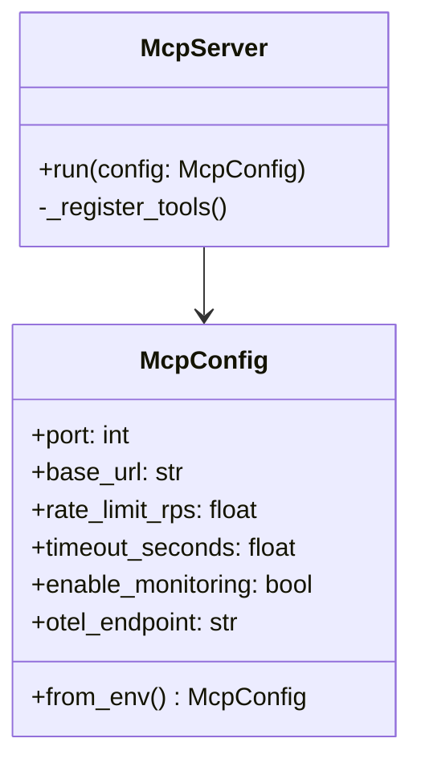
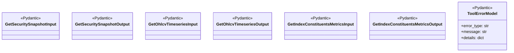
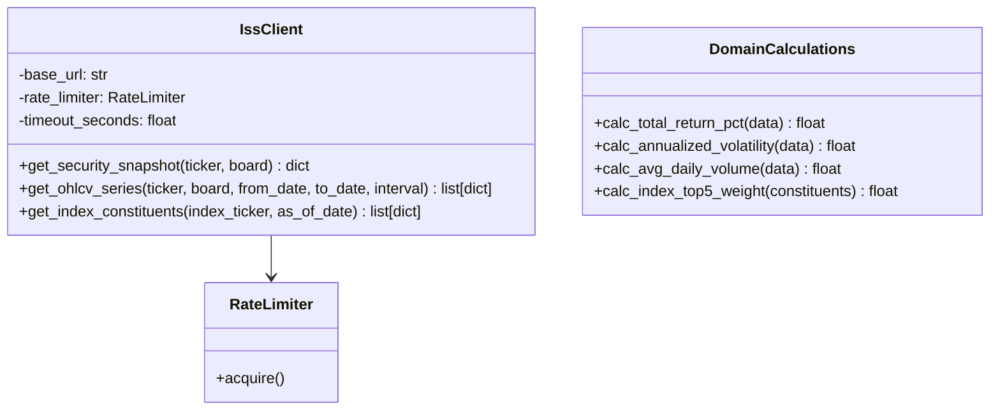
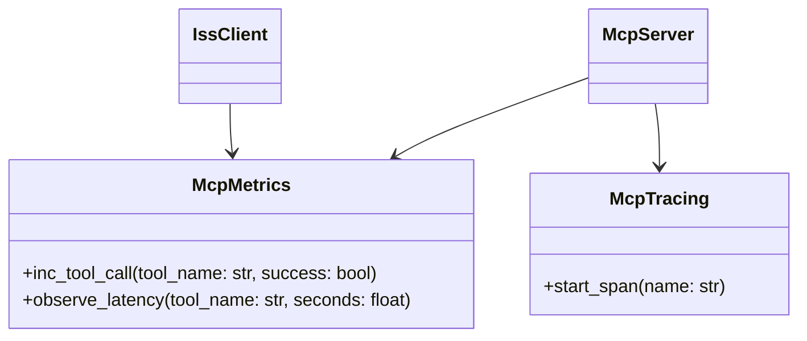

# C4 Level 4 — Code: MCP Server moex-iss-mcp

## 1. Цели уровня L4

Задача — зафиксировать структуру пакета MCP `moex-iss-mcp`, основные классы и связи.

---

## 2. Структура пакета

```text

moex_iss_mcp/
**init**.py

main.py                 # Точка входа: запуск FastMCP (transport="streamable-http")
config.py               # Загрузка env, базовые настройки MCP
logging_config.py       # Логирование

server.py               # Инициализация FastMCP, регистрация tools

models/
**init**.py
inputs.py             # Pydantic input-модели для tools
outputs.py            # Pydantic output-модели для tools
errors.py             # Pydantic-модель для error-объекта

tools/
**init**.py
security_snapshot.py  # Реализация get_security_snapshot
ohlcv_timeseries.py   # Реализация get_ohlcv_timeseries
index_constituents.py # Реализация get_index_constituents_metrics

iss/
**init**.py
client.py             # IssClient: HTTP-клиент к MOEX ISS API
endpoints.py          # Константы/хелперы по URL/параметрам ISS

domain/
**init**.py
calculations.py       # Расчёт метрик: доходность, волатильность, агрегаты

telemetry/
**init**.py
metrics.py            # Регистрация Prometheus-метрик
tracing.py            # OTEL-интеграция

```

---

## 3. Классы и их ответственность

### 3.1. Server и конфиг



**McpConfig (config.py)**

- Собирает все env:

  - `PORT`, `MOEX_ISS_BASE_URL`, `MOEX_ISS_RATE_LIMIT_RPS`, `MOEX_ISS_TIMEOUT_SECONDS`,
  - `ENABLE_MONITORING`, `OTEL_ENDPOINT`, `OTEL_SERVICE_NAME`.

**McpServer (server.py)**

- Оборачивает FastMCP:

  - в `run()` инициализирует FastMCP сервер;
  - регистрирует tools (`get_security_snapshot`, `get_ohlcv_timeseries`, `get_index_constituents_metrics`).

---

### 3.2. Модели и ошибки



Все эти классы соответствуют JSON Schema из `SPEC_moex-iss-mcp.md`.

---

### 3.3. Tools

```mermaid
classDiagram
    class GetSecuritySnapshotTool {
      +__call__(input: GetSecuritySnapshotInput) -> GetSecuritySnapshotOutput
      -_validate(input) -> GetSecuritySnapshotInput
    }

    class GetOhlcvTimeseriesTool {
      +__call__(input: GetOhlcvTimeseriesInput) -> GetOhlcvTimeseriesOutput
      -_validate(input) -> GetOhlcvTimeseriesInput
    }

    class GetIndexConstituentsMetricsTool {
      +__call__(input: GetIndexConstituentsMetricsInput) -> GetIndexConstituentsMetricsOutput
      -_validate(input) -> GetIndexConstituentsMetricsInput
    }

    class IssClient {
      +get_security_snapshot(ticker: str, board: str) dict
      +get_ohlcv_series(ticker: str, board: str, from: date, to: date, interval: str) list[dict]
      +get_index_constituents(index_ticker: str, as_of: date) list[dict]
    }

    class DomainCalculations {
      +compute_intraday_volatility(data: list[dict]) float
      +compute_return_and_volatility(data: list[dict]) dict
      +compute_index_aggregates(constituents: list[dict]) dict
    }

    class ErrorMapper {
      +map_exception(exc: Exception) ToolErrorModel
    }

    GetSecuritySnapshotTool --> IssClient
    GetSecuritySnapshotTool --> DomainCalculations
    GetSecuritySnapshotTool --> ErrorMapper

    GetOhlcvTimeseriesTool --> IssClient
    GetOhlcvTimeseriesTool --> DomainCalculations
    GetOhlcvTimeseriesTool --> ErrorMapper

    GetIndexConstituentsMetricsTool --> IssClient
    GetIndexConstituentsMetricsTool --> DomainCalculations
    GetIndexConstituentsMetricsTool --> ErrorMapper
```



**Tool-классы (`tools/*.py`)**:

- Инкапсулируют бизнес-логику вокруг ISS:

  - готовят запросы к `IssClient`;
  - вызывают `DomainCalculations` для метрик;
  - в случае ошибок используют `ErrorMapper` для формирования `error` в output-модели.

---

### 3.4. ISS-клиент и доменные расчёты



- `IssClient`:

  - знает про `MOEX_ISS_BASE_URL`, `MOEX_ISS_RATE_LIMIT_RPS`, `MOEX_ISS_TIMEOUT_SECONDS`;
  - делает реальные HTTP-вызовы;
  - реализует ретраи и тайм-ауты.

- `DomainCalculations`:

  - чистые функции без побочных эффектов.

---

### 3.5. Telemetry



---

## 4. Основной поток внутри MCP

Пример для `get_ohlcv_timeseries`:

```python
def get_ohlcv_timeseries(input: GetOhlcvTimeseriesInput) -> GetOhlcvTimeseriesOutput:
    try:
        valid_input = validate(input)
        raw_data = iss_client.get_ohlcv_series(
            ticker=valid_input.ticker,
            board=valid_input.board,
            from_date=valid_input.from_date,
            to_date=valid_input.to_date,
            interval=valid_input.interval,
        )
        metrics = domain_calculations.compute_return_and_volatility(raw_data)
        return GetOhlcvTimeseriesOutput(
            metadata=...,
            data=raw_data,
            metrics=metrics,
            error=None,
        )
    except Exception as exc:
        error_model = error_mapper.map_exception(exc)
        return GetOhlcvTimeseriesOutput(
            metadata=...,
            data=[],
            metrics={},
            error=error_model,
        )
```

---

## 5. Потребители MCP (Consumers)

В мультиагентной архитектуре `moex-iss-mcp` используется следующими компонентами:

| Потребитель | Роль | Описание использования |
|-------------|------|------------------------|
| **MarketDataSubagent** | Сабагент AI-агента | Инкапсулирует всю работу с рыночными данными. Вызывает `get_security_snapshot`, `get_ohlcv_timeseries`, `get_index_constituents_metrics`. |
| **risk-analytics-mcp** | MCP-сервер | Использует как data-provider для получения OHLCV-данных при расчёте корреляций и волатильности. |

**Важно:**
- `OrchestratorAgent` **не вызывает** MCP напрямую — только через `MarketDataSubagent`.
- Все MCP-вызовы проходят через `McpClient`, который управляет тайм-аутами, ретраями и логированием.
